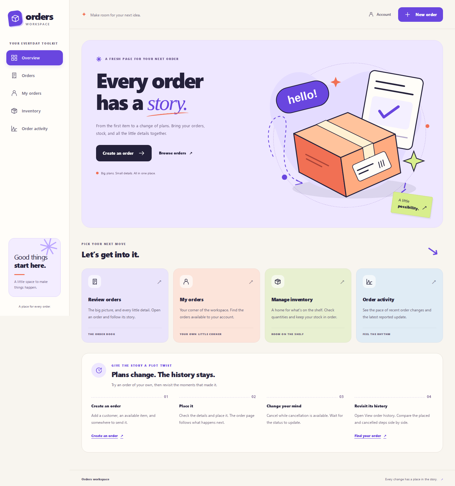
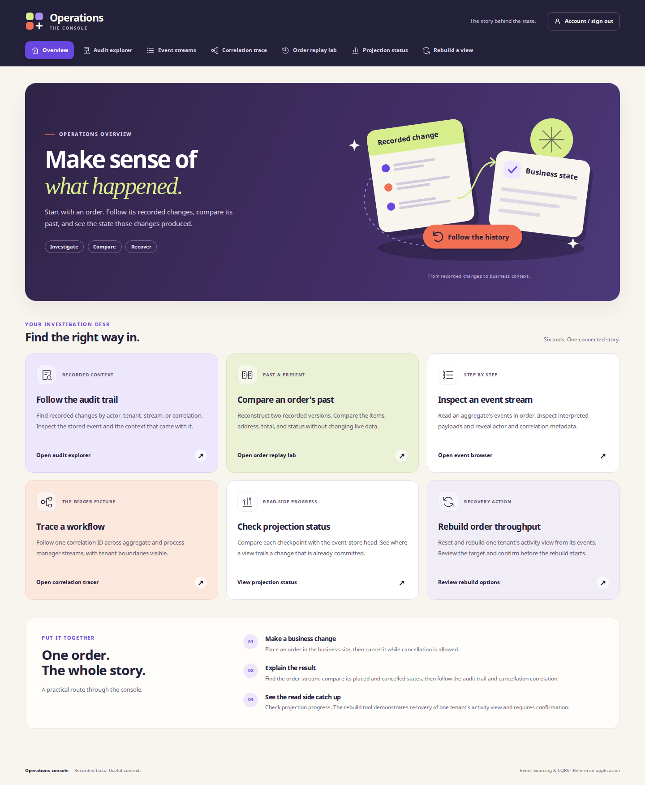

# Event Sourcing & CQRS - Reference Implementation

Companion code for the book *Event Sourcing & CQRS: A Comprehensive and Practical Guide to
Deeper Insights in Your Software Solutions* by Thomas Jaeger.

This is a production-grade reference implementation, not a sample. It exists to be cloned,
run, read, and adapted, including for commercial services. It is tagged v1.0.0, the release the
book describes, and development continues on main past the tag.

## Workspaces

The current application on `main` has two workspaces.

**Orders workspace.** Create and manage orders, review inventory, and follow an order's history.



**Operations console.** Inspect audit trails, event streams, and workflows. Compare recorded order
versions and review projection recovery tools.



See the [workspace gallery](docs/workspace-gallery.md) for the main screens and mobile views,
or follow the [demo walkthrough](docs/event-sourcing-demo-guide.md) to try the workflows.

## What it demonstrates

An order-management domain across five bounded contexts, built event-sourced end to end.

**Four event stores as first-class peers behind one `IEventStore`.** Hand-rolled PostgreSQL
via Npgsql, hand-rolled SQL Server via Microsoft.Data.SqlClient, KurrentDB over gRPC, and
DynamoDB with conditional writes. All four pass the same contract suite in
`tests/EventStore.ContractTests`. Switching between them is a configuration change.

**Five aggregates** rebuilt from events: Order in Sales, Inventory and Shipment in Fulfillment,
Payment in Billing, and UserRoles in Access. **Two process managers**, themselves event-sourced
on their own streams, with compensation branches. **Eight projections** maintaining read models
in PostgreSQL over a mix of relational tables and JSONB.

**Four hosts**: a Blazor Server UI, a JSON API, a Workers host running projections and the
outbox, and an AdminConsole carrying the operational tools. Role-based authorization and
tenant isolation run through all of them.

Fifty-three architecture decision records in `docs/adr/` carry the reasoning, including the ones
that constrain the shape: adapters are self-contained (ADR 0004), production quality wins over
teaching clarity (ADR 0025), and global position is commit-ordered (ADR 0044).

## Running it

You need Docker and the .NET 10 SDK. From the repository root:

```
docker compose -f docker/docker-compose.yml up -d
dotnet dev-certs https --trust
```

**That starts the backing stores and nothing else.** The compose file declares four services,
PostgreSQL on 5432, SQL Server on 1433, KurrentDB on 2113, and LocalStack on 4566. It does not
start the application. A reader who runs it and opens a browser gets nothing, because no host
is listening yet.

The certificate is the second half of the same step. The Web host sets the antiforgery cookie
policy to require a secure request, so it serves over HTTPS and every page returns 500 over
plain HTTP.

Every host reads its configuration from the environment and there are no `appsettings.json`
files, so none of the values below is optional and a missing one throws at startup. Export
them in each terminal you start a host from. The connection strings are the compose file's own
dev-only defaults:

```
export EVENT_STORE_CONNECTION_STRING='Host=localhost;Port=5432;Database=esrcq;Username=esrcq;Password=esrcq'
export READ_MODEL_CONNECTION_STRING='Host=localhost;Port=5432;Database=esrcq;Username=esrcq;Password=esrcq'
export FORWARDED_IDENTITY_SIGNING_SECRET='local-development-secret-not-for-any-other-environment'
export API_BASE_URL='http://localhost:5000'
export BootstrapAdministrator__AdministratorUserId='11111111-1111-1111-1111-111111111111'
export OperatorAuthentication__PasswordHash='<generated password hash>'
```

Generate the operator password hash before starting Web:

```
dotnet run --project src/Hosts/Web -- --hash-operator-password
```

Enter a password of 16 to 1024 characters at the prompt, then put the emitted hash in
`OperatorAuthentication__PasswordHash`. The prompt hides interactive input. The password never goes
in a command-line argument or configuration; configuration holds its salted ASP.NET Core Identity
hash. The hashing command exits without starting the host or opening database connections.

The `/login` form requires that password in every environment. Upgrading invalidates cookies from
the former passwordless login, requiring operators to sign in again. Login attempts are limited to ten
per minute per remote address per host instance, in both Web and AdminConsole. Deployments behind a proxy share the proxy's address
unless trusted forwarding is configured by the operator; the application does not trust arbitrary
forwarded-address headers.

Then start the hosts, one per terminal, in this order:

```
dotnet run --project src/Hosts/Workers
ASPNETCORE_URLS='http://localhost:5000' dotnet run --project src/Hosts/Api
ASPNETCORE_URLS='https://localhost:5101' dotnet run --project src/Hosts/Web
ASPNETCORE_URLS='https://localhost:5102' dotnet run --project src/Hosts/AdminConsole
```

Workers goes first because it applies the database migrations at startup, for the selected
event store and for the read models, and because it seeds the bootstrap administrator that
`BootstrapAdministrator__AdministratorUserId` names. Api serves the JSON endpoints the Web host
calls. Web serves the UI. The HTTP hosts use separate ports so they can run together. Web and AdminConsole require HTTPS
for their secure cookies; configure a trusted local development certificate before starting them.

Then open `https://localhost:5101/login` to sign in. The workspace at `/` links to orders,
your orders, inventory, and throughput. Navigation stays available on each screen, and order
and customer identifiers link to their detail views. Use Account to sign out.

Open `https://localhost:5102/login` to sign in to AdminConsole separately. It reads the same
operator password-hash and bootstrap-actor settings shown above, but issues its own cookie.
Signing in or out of Web does not sign in or out of AdminConsole. Its static account form works
before the protected interactive connection is established. Use Account / sign out to end that session.

AdminConsole exposes audit exploration, stream inspection, correlation tracing, order-history
comparison, projection status, and read-model rebuilds.
On PostgreSQL, Event streams and Correlation trace offer selectable ID lists, 25 per page,
with event counts and latest event times. Correlations also show stream and tenant counts.
The lists cover all tenants, in ID order. Select an ID to inspect it, or enter an ID directly.
Refresh starts again at the first page. KurrentDB and DynamoDB retain direct stream lookup;
ID discovery is unavailable on those providers.
Its host-wide gate resolves the signed-in actor's current roles from the read-model database and
requires console access. Workers must have projected the bootstrap administrator's role first.
PostgreSQL supports all six tools; KurrentDB and DynamoDB report the tracing, audit, and history-comparison limitations,
and SQL Server remains unsupported by this host. See [ADR 0040](docs/adr/0040-adminconsole-host-authorization-posture.md)
and the [UI revision record](docs/ui-revision-2026-10-07.md) for scope and verification.

The credentials in the compose file are dev-only defaults, stated as such in its own header.
They are not for any other environment.

### Configuration

Every host reads its configuration from the environment. There are no `appsettings.json` files.

| Key | Read by | Notes |
| --- | --- | --- |
| `EVENT_STORE_PROVIDER` | Api, Workers, AdminConsole | `Postgres`, `SqlServer`, `Kurrent`, or `DynamoDb`. Absent means `Postgres` |
| `EVENT_STORE_CONNECTION_STRING` | Api, Workers, AdminConsole | Required unless the provider is `DynamoDb` |
| `READ_MODEL_CONNECTION_STRING` | all four | Always PostgreSQL, whichever event store is selected |
| `EVENT_STORE_DYNAMODB_SERVICE_URL` | Api, Workers, AdminConsole | DynamoDB only |
| `EVENT_STORE_DYNAMODB_TABLE_NAME` | Api, Workers, AdminConsole | DynamoDB only |
| `API_BASE_URL` | Web | Where the Api host is listening |
| `FORWARDED_IDENTITY_SIGNING_SECRET` | Api, Web | Signs the identity the Web host forwards to Api |
| `BootstrapAdministrator:AdministratorUserId` | Web, Workers, AdminConsole | The first administrator's user id |
| `OperatorAuthentication:PasswordHash` | Web, AdminConsole | Required salted Identity V3 password hash; generate with `--hash-operator-password` |

A missing required key throws at startup with the key named. Nothing falls back silently.

### Switching the event store

Set `EVENT_STORE_PROVIDER` and restart. No domain code changes. An unrecognized value fails
the host at startup with the value named, rather than falling back, because a typo that
silently composed the other engine would write events to the wrong database.

### Upgrading an existing deployment

Stop old Web, API, Workers, AdminConsole, and seeder processes before installing this revision.
Old Web instances still permit passwordless login; old AdminConsole instances rebuild without
coordinating with live projections. Configure the operator password hash and restart only upgraded
hosts before reopening traffic or rebuild operations.

Inventory creation now uses an authoritative SKU registry in the shared PostgreSQL companion
database; old binaries bypass that registry. The normal Workers migration run installs migration
0029 there for every event-store provider. The first inventory creation backfills the registry from
authoritative events under a database lock. Conflicting historical mappings stop initialization and
require operator reconciliation.

A SKU claim survives an uncertain or failed event append. Retry with the same tenant, SKU, and
inventory ID; changing the ID is a conflicting creation. The `write_side` schema is durable write-side
state and must be backed up with the deployment. Projection rebuilds never reset it.

See [ADR 0056](docs/adr/0056-reference-review-corrections.md) for recovery behavior and remaining
operational limits.

### Applying migrations by hand

Workers applies migrations at startup. To run them separately against PostgreSQL:

```
EVENT_STORE_CONNECTION_STRING=... dotnet run --project src/Infrastructure/EventStore.Postgres.Cli -- migrate
```

Its usage is `EventStore.Postgres.Cli migrate [--dry-run]`. The dry run reports what is pending
and writes nothing.

### Seeding the demo scenarios

The seeder drives the system through named scenarios, so the read side has something to show
without arranging each case through the UI. Workers must already be running, because that host
is where projections advance and no scenario finishes without it.

```
EVENT_STORE_CONNECTION_STRING=... READ_MODEL_CONNECTION_STRING=... \
  dotnet run --project src/Demo/Demo.Seeder -- all
```

Its usage is `Demo.Seeder <scenario>`, where the scenario is `clean`, `compensation`, `tenants`
or `all`. With no argument it runs `all`. An unknown scenario exits 64, and a missing connection
string exits 78 naming the one that is absent.

### Demonstrating history, audit, and replay

The business site includes order-history comparisons. In Admin, use **Audit explorer** to
investigate recorded changes and **Order replay lab** to compare reconstructed order states.
The [demo guide](docs/event-sourcing-demo-guide.md) connects these screens with correlation
tracing, projection status, and the existing rebuild operation.

The new history and audit readers currently support PostgreSQL. Other configured providers
report their availability explicitly. See the [live demo verification record](docs/demo-testing-2026-10-07.md)
for tested business and Admin flows and current limitations.

## Build and test

The same commands CI runs, from `.github/workflows/ci.yml`:

```
dotnet restore EventSourcingCqrs.slnx
dotnet build EventSourcingCqrs.slnx --no-restore
dotnet test EventSourcingCqrs.slnx --no-build --verbosity normal
```

The integration tests stand up their own containers through Testcontainers and LocalStack, so
Docker has to be running. They do not use the compose file above.

## The migration demo

`src/Migration/` is a standalone Chapter 18 teaching artifact: a CRUD-shaped legacy order
system and four patterns that carry it toward event sourcing, with its own compose file and
its own PostgreSQL on 5433 so it runs alongside the main one. See
[src/Migration/README.md](./src/Migration/README.md).

## How to extend it

**A new event store.** Implement `IEventStore` in a new project under `src/Infrastructure/`,
keep it self-contained per ADR 0004, and make it pass `tests/EventStore.ContractTests`. That
suite is the definition of done for an adapter; the four shipped adapters pass the same facts.

**A new projection.** Implement `IProjection`, register it, and give it its own checkpoint.
Projections are pull-based, idempotent, and never call back into the write side.

**A new aggregate.** Derive from `AggregateRoot`, raise events from command methods, and
rebuild state through `Apply`. Load and save through `IEventStoreRepository<TAggregate>`, which
is generic because every aggregate shares one replay path.

`CLAUDE.md` carries the architectural rules a change has to hold to, and the folder layout it
lands in.

## Finding the code for a chapter

`docs/chapter-to-code-map.md` is the map. It gives the files and folders for each chapter
that has code, and says which chapters have none and why that is the intent rather than a
gap. Its chapter side is grounded on the manuscript's generated table of contents rather
than on anything in this repository, so regenerating that table there is what re-checks
this map.

It does not replace the two finer-grained pointers that were already here. Source files name
the chapter they demonstrate in a comment, and `docs/architecture/cross-context-vocabulary.md`
is the worked example for Chapter 7's context mapping.

## Where to read more

- `docs/ARCHITECTURE.md` for the cross-cutting decisions and which ADR owns each one. It
  routes into the code, which is where what currently ships is read.
- `docs/adr/` for the decisions and their reasoning.
- `docs/architecture/cross-context-vocabulary.md` for what crosses each bounded-context
  boundary, and what does not.
- `CLAUDE.md` for the repo-wide rules, the stack, and the folder layout.
- `docs/PLAN.md` for the scope v1 committed to and the definition of done. It records intent; what
  currently ships is read from the code.

## Making the case internally

`decks/` holds two executive briefing decks, MIT licensed like everything else here, for the reader
whose next problem is convincing a leadership team rather than writing code. A twelve-slide
architectural argument and a thirteen-slide narrative pitch, both editable, with the slide sources
beside them. `decks/README.md` describes what each one argues.

The slide that matters is the one naming what event sourcing costs. Chapter 5 of the book is its
long form, and this repository is what the decks are describing.

## License

MIT. See [LICENSE](./LICENSE).
